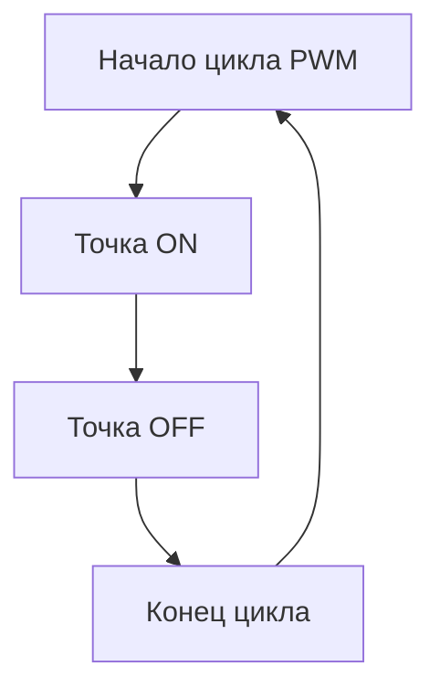
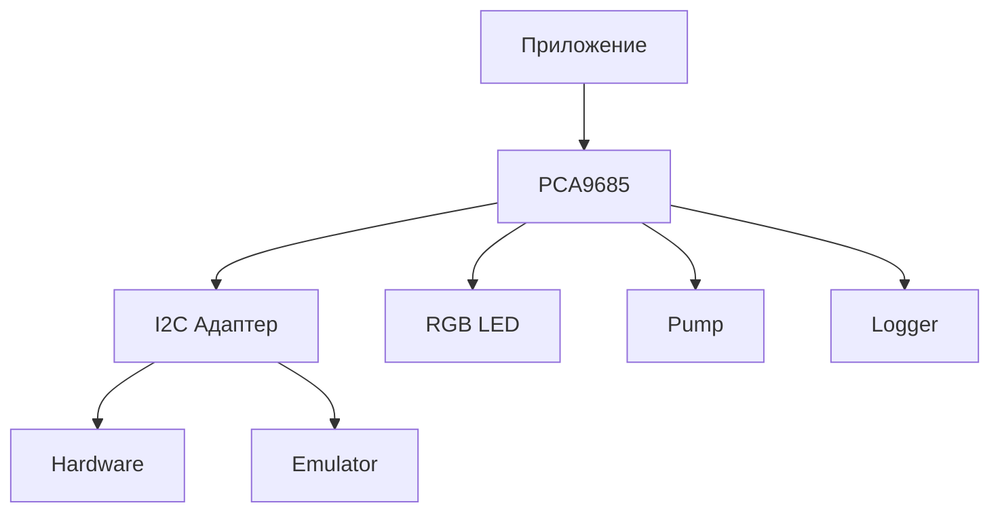

# Техническая документация PCA9685

## Содержание

1. [Введение](#введение)
2. [Принципы работы PCA9685](#принципы-работы-pca9685)
3. [Архитектура библиотеки](#архитектура-библиотеки)
4. [Подробное описание компонентов](#подробное-описание-компонентов)
5. [Система I2C и адаптеры](#система-i2c-и-адаптеры)
6. [Управление PWM](#управление-pwm)
7. [Специализированные контроллеры](#специализированные-контроллеры)
8. [Система логирования](#система-логирования)
9. [Тестирование и эмуляция](#тестирование-и-эмуляция)
10. [Рекомендации по использованию](#рекомендации-по-использованию)

## Введение

### О микроконтроллере PCA9685

PCA9685 - это 16-канальный PWM-контроллер с управлением через I²C интерфейс. Основные характеристики:

- 16 независимых PWM каналов
- 12-битное разрешение для каждого канала (4096 уровней)
- Частота PWM: от 24 Гц до 1526 Гц
- I²C интерфейс со скоростью до 1 МГц
- Встроенный осциллятор 25 МГц
- Напряжение питания: 2.3В - 5.5В
- Выходной ток до 25 мА на канал
- Возможность каскадирования до 62 устройств

### Назначение библиотеки

Библиотека предоставляет высокоуровневый интерфейс для работы с PCA9685 на языке Go, обеспечивая:

- Абстракцию над I²C коммуникацией
- Потокобезопасное управление каналами
- Специализированные контроллеры для RGB светодиодов и насосов
- Расширенные возможности мониторинга и логирования
- Поддержку тестирования через эмуляцию

## Принципы работы PCA9685

### Регистровая модель

PCA9685 использует систему регистров для управления:

| Регистр    | Адрес | Назначение                          |
|------------|-------|-------------------------------------|
| MODE1      | 0x00  | Режим работы 1                      |
| MODE2      | 0x01  | Режим работы 2                      |
| LED0_ON_L  | 0x06  | Время включения канала 0 (младший байт) |
| LED0_ON_H  | 0x07  | Время включения канала 0 (старший байт) |
| LED0_OFF_L | 0x08  | Время выключения канала 0 (младший байт) |
| LED0_OFF_H | 0x09  | Время выключения канала 0 (старший байт) |
| ...        | ...   | ...                                 |
| ALL_LED    | 0xFA  | Управление всеми каналами           |
| PRE_SCALE  | 0xFE  | Предделитель для частоты PWM        |

### Принцип формирования PWM

PWM сигнал формируется следующим образом:

1. Каждый цикл PWM имеет 4096 тактов
2. Для каждого канала задаются точки включения (ON) и выключения (OFF)
3. Длительность импульса определяется разницей между OFF и ON
4. Частота PWM настраивается через предделитель по формуле:
   ```
   freq = 25MHz / (4096 * (prescale + 1))
   ```



## Архитектура библиотеки

### Основные компоненты

1. **Базовый контроллер (PCA9685)**
   - Управление регистрами
   - Настройка частоты
   - Управление каналами

2. **Система адаптеров**
   - Абстракция I²C коммуникации
   - Поддержка разных библиотек
   - Эмулятор для тестирования

3. **Специализированные контроллеры**
   - RGB светодиоды
   - Насосы
   - Расширяемая система

4. **Система логирования**
   - Многоуровневое логирование
   - Настраиваемые обработчики
   - Отладочная информация

### Взаимодействие компонентов



## Подробное описание компонентов

### PCA9685 - основной контроллер

#### Структура
```go
type PCA9685 struct {
    dev      I2C           // I2C интерфейс
    mu       sync.RWMutex  // Мьютекс для синхронизации
    Freq     float64       // Текущая частота PWM
    channels [16]Channel   // Массив каналов
    ctx      context.Context // Контекст для отмены
    cancel   context.CancelFunc // Функция отмены
    logger   Logger        // Система логирования
}
```

#### Методы инициализации

##### New
```go
func New(dev I2C, config *Config) (*PCA9685, error)
```
Создает новый экземпляр контроллера.

**Параметры:**
- `dev`: Интерфейс I2C для коммуникации
- `config`: Конфигурация контроллера

**Процесс инициализации:**
1. Проверка параметров
2. Инициализация логгера
3. Сброс контроллера
4. Настройка режимов работы
5. Установка частоты PWM

**Возможные ошибки:**
- Ошибки инициализации I2C
- Ошибки конфигурации
- Ошибки установки частоты

##### Reset
```go
func (pca *PCA9685) Reset() error
```
Сбрасывает контроллер в исходное состояние.

**Операции:**
1. Установка спящего режима
2. Включение автоинкремента
3. Очистка всех регистров

#### Методы управления PWM

##### SetPWMFreq
```go
func (pca *PCA9685) SetPWMFreq(freq float64) error
```
Устанавливает частоту PWM.

**Параметры:**
- `freq`: Частота в Гц (24-1526)

**Процесс:**
1. Проверка диапазона частоты
2. Расчет предделителя
3. Перевод в спящий режим
4. Установка предделителя
5. Восстановление режима
6. Стабилизация осциллятора

**Формула расчета предделителя:**
```go
prescale := math.Round(float64(OscClock)/(float64(PwmResolution)*freq)) - 1
```

##### SetPWM
```go
func (pca *PCA9685) SetPWM(ctx context.Context, channel int, on, off uint16) error
```
Устанавливает параметры PWM для канала.

**Параметры:**
- `ctx`: Контекст для отмены операции
- `channel`: Номер канала (0-15)
- `on`: Точка включения (0-4095)
- `off`: Точка выключения (0-4095)

**Процесс:**
1. Проверка номера канала
2. Проверка состояния канала
3. Запись значений в регистры
4. Обновление состояния канала

**Особенности:**
- Поддержка отмены через контекст
- Потокобезопасность через мьютексы
- Валидация параметров

##### SetMultiPWM
```go
func (pca *PCA9685) SetMultiPWM(ctx context.Context, settings map[int]struct{On, Off uint16}) error
```
Групповая установка PWM.

**Параметры:**
- `settings`: Карта настроек для каналов

**Оптимизации:**
- Минимизация обращений к I2C
- Атомарность операции
- Проверка всех параметров перед записью

### Специализированные контроллеры

#### RGB светодиод

##### Структура
```go
type RGBLed struct {
    pca         *PCA9685
    channels    [3]int
    brightness  float64
    mu          sync.RWMutex
    calibration RGBCalibration
}
```

##### Калибровка
```go
type RGBCalibration struct {
    RedMin, RedMax     uint16
    GreenMin, GreenMax uint16
    BlueMin, BlueMax   uint16
}
```

##### Методы

###### SetColor
```go
func (l *RGBLed) SetColor(ctx context.Context, r, g, b uint8) error
```
Устанавливает цвет светодиода.

**Процесс:**
1. Применение калибровки
2. Учет яркости
3. Масштабирование значений
4. Установка PWM для каждого канала

**Формула масштабирования:**
```go
scaled := uint16((float64(value) * brightness * float64(max-min) / 255.0) + float64(min))
```

#### Насос

##### Структура
```go
type Pump struct {
    pca      *PCA9685
    channel  int
    MinSpeed uint16
    MaxSpeed uint16
    mu       sync.RWMutex
}
```

##### Методы

###### SetSpeed
```go
func (p *Pump) SetSpeed(ctx context.Context, percent float64) error
```
Устанавливает скорость насоса.

**Процесс:**
1. Проверка диапазона скорости
2. Масштабирование в PWM
3. Установка PWM
4. Обновление состояния

**Формула масштабирования:**
```go
value := scale(percent, p.MinSpeed, p.MaxSpeed)
func scale(percent float64, min, max uint16) uint16 {
    range_ := float64(max - min)
    value := math.Round((percent * range_) / 100.0)
    return uint16(value) + min
}
```

## Система I2C и адаптеры

### Интерфейс I2C
```go
type I2C interface {
    WriteReg(reg uint8, data []byte) error
    ReadReg(reg uint8, data []byte) error
    Close() error
}
```

### Реализации адаптеров

#### D2r2 Адаптер
```go
type I2CAdapterD2r2 struct {
    dev    *i2c.I2C
    logger Logger
}
```

**Особенности:**
- Поддержка Linux
- Прямой доступ к I2C
- Полный контроль над транзакциями

#### Periph.io Адаптер
```go
type I2CAdapterPeriph struct {
    dev    *periph_i2c.Dev
    logger Logger
}
```

**Особенности:**
- Кроссплатформенность
- Высокоуровневый API
- Встроенная валидация

#### Тестовый адаптер
```go
type TestI2C struct {
    mu        sync.RWMutex
    registers map[uint8][]byte
    logger    Logger
}
```

**Возможности:**
- Эмуляция регистров
- Проверка операций
- Симуляция ошибок

## Система логирования

### Интерфейс
```go
type Logger interface {
    Basic(msg string, args ...interface{})
    Detailed(msg string, args ...interface{})
    Error(msg string, args ...interface{})
}
```

### Уровни логирования
```go
type LogLevel int

const (
    LogLevelBasic LogLevel = iota
    LogLevelDetailed
)
```

### Стандартный логгер
```go
type defaultLogger struct {
    level LogLevel
}
```

**Функциональность:**
- Фильтрация по уровню
- Форматирование сообщений
- Метки времени
- Категоризация сообщений

## Тестирование и эмуляция

### Тестовый адаптер

#### Возможности эмуляции:
- Эмуляция регистров
- Проверка последовательности операций
- Симуляция задержек и ошибок
- Валидация параметров

#### Методы тестирования:
- Модульные тесты
- Интеграционные тесты
- Стресс-тесты
- Тестирование граничных условий

## Рекомендации по использованию

### Производительность

1. **Оптимизация I2C операций:**
   - Использование групповых операций
   - Минимизация изменений частоты
   - Буферизация команд

2. **Работа с потоками:**
   - Правильное использование мьютексов
   - Избегание длительных блокировок
   - Использование контекстов для отмены

3. **Управление ресурсами:**
   - Своевременное закрытие устройств
   - Освобождение неиспользуемых каналов
   - Контроль утечек памяти

### Надежность

1. **Обработка ошибок:**
   - Проверка всех возвращаемых ошибок
   - Корректная обработка ошибок I2C
   - Восстановление после сбоев
   - Логирование ошибок

2. **Защита от сбоев:**
   - Валидация входных параметров
   - Проверка состояния устройства
   - Восстановление после потери связи
   - Защита от некорректных значений

3. **Мониторинг состояния:**
   - Регулярная проверка связи
   - Отслеживание температуры
   - Контроль напряжения
   - Мониторинг производительности

### Безопасность

1. **Защита от неправильного использования:**
   - Проверка диапазонов значений
   - Защита от одновременного доступа
   - Предотвращение конфликтов каналов
   - Валидация конфигурации

2. **Защита оборудования:**
   - Плавный старт и остановка
   - Ограничение максимальных значений
   - Защита от перегрузки
   - Температурный контроль

### Расширяемость

1. **Создание новых устройств:**
```go
// Пример создания нового типа устройства
type MyDevice struct {
    pca     *PCA9685
    channel int
    config  MyConfig
}

func NewMyDevice(pca *PCA9685, channel int, config MyConfig) (*MyDevice, error) {
    // Валидация параметров
    if err := validateConfig(config); err != nil {
        return nil, err
    }

    // Проверка канала
    if err := pca.validateChannel(channel); err != nil {
        return nil, err
    }

    // Создание устройства
    device := &MyDevice{
        pca:     pca,
        channel: channel,
        config:  config,
    }

    // Инициализация
    if err := device.init(); err != nil {
        return nil, err
    }

    return device, nil
}
```

2. **Создание новых адаптеров:**
```go
// Пример создания нового I2C адаптера
type MyI2CAdapter struct {
    device MyI2CDevice
    logger Logger
}

func NewMyI2CAdapter(device MyI2CDevice) *MyI2CAdapter {
    return &MyI2CAdapter{
        device: device,
        logger: NewDefaultLogger(LogLevelBasic),
    }
}

func (a *MyI2CAdapter) WriteReg(reg uint8, data []byte) error {
    a.logger.Detailed("WriteReg: reg=0x%X, data=%v", reg, data)
    return a.device.Write(reg, data)
}

func (a *MyI2CAdapter) ReadReg(reg uint8, data []byte) error {
    a.logger.Detailed("ReadReg: reg=0x%X", reg)
    return a.device.Read(reg, data)
}
```

## Примеры использования

### Базовое управление PWM

```go
func basicPWMExample() error {
    // Инициализация I2C
    i2c, err := i2c.NewI2C(0x40, 1)
    if err != nil {
        return err
    }
    defer i2c.Close()

    // Создание адаптера
    adapter := NewI2CAdapterD2r2(i2c)

    // Создание контроллера
    config := DefaultConfig()
    config.InitialFreq = 1000
    config.LogLevel = LogLevelDetailed

    pca, err := New(adapter, config)
    if err != nil {
        return err
    }
    defer pca.Close()

    // Установка PWM
    ctx := context.Background()
    if err := pca.SetPWM(ctx, 0, 0, 2048); err != nil {
        return err
    }

    return nil
}
```

### Управление RGB светодиодом

```go
func rgbExample() error {
    // ... инициализация контроллера ...

    // Создание RGB светодиода
    led, err := NewRGBLed(pca, 0, 1, 2)
    if err != nil {
        return err
    }

    // Калибровка
    cal := RGBCalibration{
        RedMax:   4095,
        GreenMax: 3500,
        BlueMax:  3000,
    }
    led.SetCalibration(cal)

    // Установка цвета
    ctx := context.Background()
    if err := led.SetColor(ctx, 255, 0, 0); err != nil {
        return err
    }

    // Плавное изменение яркости
    for b := 0.0; b <= 1.0; b += 0.1 {
        if err := led.SetBrightness(b); err != nil {
            return err
        }
        time.Sleep(100 * time.Millisecond)
    }

    return nil
}
```

### Управление насосом

```go
func pumpExample() error {
    // ... инициализация контроллера ...

    // Создание насоса
    pump, err := NewPump(pca, 0, WithSpeedLimits(1000, 3000))
    if err != nil {
        return err
    }

    // Плавный запуск
    ctx := context.Background()
    for speed := 0.0; speed <= 100.0; speed += 10.0 {
        if err := pump.SetSpeed(ctx, speed); err != nil {
            return err
        }
        time.Sleep(500 * time.Millisecond)
    }

    // Работа на полной скорости
    time.Sleep(5 * time.Second)

    // Плавная остановка
    return pump.Stop(ctx)
}
```


## Дополнительные возможности (В основном коде не реализовано, предлагается как пример расширения функционала)

### Мониторинг и диагностика

1. **Сбор статистики:**
```go
type Statistics struct {
    TotalOperations uint64
    Errors          uint64
    LastError       error
    Uptime          time.Duration
    Temperature     float64
}

func (pca *PCA9685) GetStatistics() Statistics {
    pca.mu.RLock()
    defer pca.mu.RUnlock()
    return pca.statistics
}
```

2. **Диагностика проблем:**
```go
func (pca *PCA9685) Diagnose() []DiagnosticResult {
    results := make([]DiagnosticResult, 0)

    // Проверка связи
    if err := pca.checkConnection(); err != nil {
        results = append(results, DiagnosticResult{
            Component: "I2C",
            Status:    "Error",
            Error:     err,
        })
    }

    // Проверка регистров
    if err := pca.checkRegisters(); err != nil {
        results = append(results, DiagnosticResult{
            Component: "Registers",
            Status:    "Error",
            Error:     err,
        })
    }

    // Проверка каналов
    for i := 0; i < 16; i++ {
        if err := pca.checkChannel(i); err != nil {
            results = append(results, DiagnosticResult{
                Component: fmt.Sprintf("Channel %d", i),
                Status:    "Error",
                Error:     err,
            })
        }
    }

    return results
}
```

### Энергосбережение

1. **Режимы энергопотребления:**
```go
// Перевод в режим сна
func (pca *PCA9685) Sleep() error {
    pca.mu.Lock()
    defer pca.mu.Unlock()

    mode1, err := pca.readMode1()
    if err != nil {
        return err
    }

    return pca.dev.WriteReg(RegMode1, []byte{mode1 | Mode1Sleep})
}

// Пробуждение
func (pca *PCA9685) Wakeup() error {
    pca.mu.Lock()
    defer pca.mu.Unlock()

    mode1, err := pca.readMode1()
    if err != nil {
        return err
    }

    // Сброс бита сна
    if err := pca.dev.WriteReg(RegMode1, []byte{mode1 & ^Mode1Sleep}); err != nil {
        return err
    }

    // Ожидание стабилизации осциллятора
    time.Sleep(500 * time.Microsecond)

    return nil
}
```

2. **Оптимизация энергопотребления:**
```go
// Отключение неиспользуемых каналов
func (pca *PCA9685) OptimizePower() error {
    pca.mu.Lock()
    defer pca.mu.Unlock()

    for i := 0; i < 16; i++ {
        if !pca.channels[i].enabled {
            // Установка нулевых значений PWM
            if err := pca.SetPWM(context.Background(), i, 0, 0); err != nil {
                return err
            }
        }
    }

    return nil
}
```

### Синхронизация нескольких устройств

1. **Подключение нескольких контроллеров:**
```go
type MultiPCA struct {
    controllers []*PCA9685
    mu          sync.RWMutex
}

func NewMultiPCA(controllers ...*PCA9685) *MultiPCA {
    return &MultiPCA{
        controllers: controllers,
    }
}

// Синхронная установка PWM на всех контроллерах
func (m *MultiPCA) SetAllPWM(ctx context.Context, on, off uint16) error {
    m.mu.Lock()
    defer m.mu.Unlock()

    var wg sync.WaitGroup
    errs := make(chan error, len(m.controllers))

    for _, pca := range m.controllers {
        wg.Add(1)
        go func(p *PCA9685) {
            defer wg.Done()
            if err := p.SetAllPWM(ctx, on, off); err != nil {
                errs <- err
            }
        }(pca)
    }

    wg.Wait()
    close(errs)

    // Сбор ошибок
    var errors []error
    for err := range errs {
        errors = append(errors, err)
    }

    if len(errors) > 0 {
        return fmt.Errorf("multiple errors: %v", errors)
    }

    return nil
}
```

2. **Каскадное подключение:**
```go
type Cascade struct {
    devices  []*PCA9685
    channels int
}

func NewCascade(devices ...*PCA9685) *Cascade {
    return &Cascade{
        devices:  devices,
        channels: len(devices) * 16,
    }
}

// Преобразование глобального номера канала в локальный
func (c *Cascade) mapChannel(channel int) (device *PCA9685, localChannel int, err error) {
    if channel < 0 || channel >= c.channels {
        return nil, 0, fmt.Errorf("invalid channel number: %d", channel)
    }

    deviceIndex := channel / 16
    localChannel = channel % 16

    return c.devices[deviceIndex], localChannel, nil
}

// Установка PWM для канала в каскаде
func (c *Cascade) SetPWM(ctx context.Context, channel int, on, off uint16) error {
    device, localChannel, err := c.mapChannel(channel)
    if err != nil {
        return err
    }

    return device.SetPWM(ctx, localChannel, on, off)
}
```

## Заключение

При разработке следуйте рекомендациям и лучшим практикам для достижения оптимальной производительности и надежности вашего приложения.